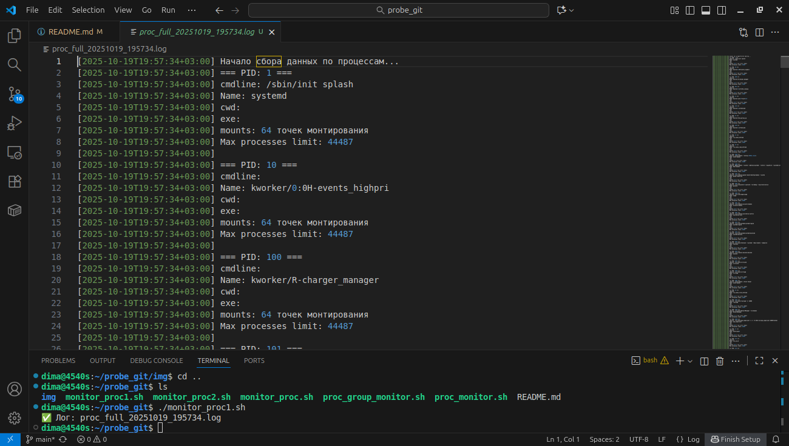
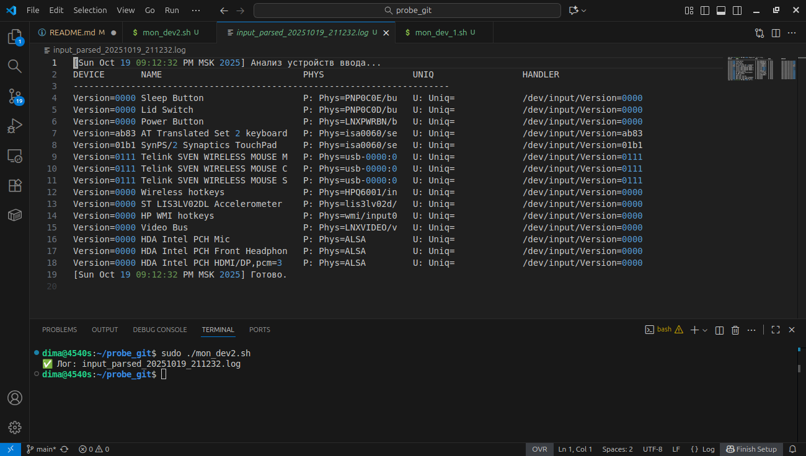

# Итоговый проект Bash 

# Герасин Дмитрий Сергеевич
## студент школы натология.

---

### 1 задание 

1. Задание по созданию Bash-скрипта, который будет выполнять мониторинг содержимого директории proc, получать сведения о процессах и системных данных о них, сбор полученной информации в логе

#### 1.1 Напишите Bash-скрипт, который выполняет просмотр директории /proc и записывает номерные директории.

В данном скрипте мы проверяем только дирректории которые представлены числом,  
номером процесса PID, для реализации данного скрипта задействован цикл for.

   bash

#!/bin/bash

LOG_FILE="proc_pids_$(date +%Y%m%d_%H%M%S).log"
echo "[$(date)] Сканирование /proc..." > "$LOG_FILE"

for entry in /proc/*; do
    pid=$(basename "$entry")
    if [[ "$pid" =~ ^[0-9]+$ ]] && [ -d "$entry" ]; then
        if exe_path=$(readlink "$entry/exe" 2>/dev/null); then
            echo "$pid: $exe_path" >> "$LOG_FILE"
        else
            echo "$pid: <не удалось прочитать exe>" >> "$LOG_FILE"
        fi
    fi
done

echo "[$(date)] Создан Лог: $LOG_FILE" >> "$LOG_FILE"

Данный скрипт создает лог файл. 

В логфайле номера процессов, в созданном файле прописывается дата и время  запуска скрипта. 

По окончанию работы скрипта создается файл и помещается в дирректорию где находится скрипт

результат работы скрипта представлен на скриншоте ниже 

#### 1.2 Дополнить скрипт, чтобы он получал имя процесса по номеру директории через прочтения /proc/N/exe (PID = номер папки)

   bash

#!/bin/bash

LOG_FILE="proc_pids_$(date +%Y%m%d_%H%M%S).log"
echo "[$(date)] Сканирование /proc..." > "$LOG_FILE"

for entry in /proc/*; do
    pid=$(basename "$entry")
    if [[ "$pid" =~ ^[0-9]+$ ]] && [ -d "$entry" ]; then
        if exe_path=$(readlink "$entry/exe" 2>/dev/null); then
            echo "$pid: $exe_path" >> "$LOG_FILE"
        else
            echo "$pid: <не удалось прочитать exe>" >> "$LOG_FILE"
        fi
    fi
done

echo "[$(date)] Готово. Лог: $LOG_FILE" >> "$LOG_FILE"
      
  
запустили скрипт создали файл 
результат на скриншоте

#### 1.3 Дополнить скрипт, чтобы по каждому процессу можно было выбрать группу параметров, не менее 4 

выполнили задание условно выделили 4 группы main|resources|files|system
Группа
main
Основная информация о процессе
cmdline,status, cwd, environ
resources
Ресурсы и ограничения
status, limits, mounts, fd
files
Файловая система
cmdline, environ, root, fdinfo
system
Системные параметры
status, cwd, root, fd

Скришот содержимого созданного файла

#### 1.4  оформил вывод файла с наименованием столбцов PID, Name, и 6 параметров, которые вы выбрали в предыдущем пункте задания 
 
Скриншот содержимого и запуска скрипта.

#### 1.4.1 вывод файла в виде таблицы, запускаем скрипт с аргументом названием группы 
для доступа ко всем прцессам необходимо запускать скрипт от пользователя root

пример запуска и сама таблица в созданном файле на скриншоте

#### 1.5 Дополнить скрипт, чтобы создавался лог файл с записью времени выполнения скрипта и занесения новых процессов. Старые процессы не заносятся

В результате доработки скрипта в процессе поэтапного выполнения заданий получили итоговый скрипт 
   bash
 #!/bin/bash

#### скрипт покажет процессы пользователя, чтобы отслеживать все процессы
#### необходимы права root используйте sudo

GROUP="$1"
if [[ ! "$GROUP" =~ ^(main|resources|files|system)$ ]]; then
    echo "Использование: $0 <main|resources|files|system>"
    exit 1
fi

LOG_FILE="proc_new_${GROUP}_$(date +%Y%m%d_%H%M%S).log"
CACHE_FILE="/tmp/proc_last_pids"

START_TIME=$(date)
echo "[$START_TIME] Скрипт запущен. Группа: $GROUP" > "$LOG_FILE"

CURRENT_PIDS=()
for entry in /proc/*; do
    pid=$(basename "$entry")
    if [[ "$pid" =~ ^[0-9]+$ ]] && [ -d "$entry" ]; then
        CURRENT_PIDS+=("$pid")
    fi
done

if [ -f "$CACHE_FILE" ]; then
    mapfile -t LAST_PIDS < "$CACHE_FILE"
else
    LAST_PIDS=()
fi

declare -A LAST_MAP
for p in "${LAST_PIDS[@]}"; do LAST_MAP["$p"]=1; done

case "$GROUP" in
    main)      COLS=("PID" "Name" "cmdline" "cwd" "environ_vars") ;;
    resources) COLS=("PID" "Name" "max_procs" "mounts" "fd_count") ;;
    files)     COLS=("PID" "cmdline" "environ_vars" "root" "fdinfo_count") ;;
    system)    COLS=("PID" "Name" "cwd" "root" "fd_count") ;;
esac

printf -v header "%-8s %-20s %-30s %-30s %-15s" "${COLS[@]}"
echo "$header" >> "$LOG_FILE"
echo "${header//?/-}" >> "$LOG_FILE"

NEW_FOUND=0

for pid in "${CURRENT_PIDS[@]}"; do
    if [ -z "${LAST_MAP[$pid]}" ]; then
            entry="/proc/$pid"
        name=$(grep -m1 "^Name:" "$entry/status" 2>/dev/null | cut -f2)
        cmdline=$(tr '\0' ' ' < "$entry/cmdline" 2>/dev/null | sed 's/ $//' | cut -c1-28)
        cwd=$(readlink "$entry/cwd" 2>/dev/null | cut -c1-28)
        root=$(readlink "$entry/root" 2>/dev/null | cut -c1-28)
        environ_vars=$(tr '\0' '\n' < "$entry/environ" 2>/dev/null | wc -l)
        max_procs=$(grep -m1 "Max processes" "$entry/limits" 2>/dev/null | awk '{print $4}')
        mounts=$(wc -l < "$entry/mounts" 2>/dev/null)
        fd_count=$(ls -1 "$entry/fd" 2>/dev/null | wc -l)
        fdinfo_count=$(ls -1 "$entry/fdinfo" 2>/dev/null | wc -l)

        case "$GROUP" in
            main)
                printf "%-8s %-20s %-30s %-30s %-15s\n" "$pid" "$name" "$cmdline" "$cwd" "$environ_vars" >> "$LOG_FILE"
                ;;
            resources)
                printf "%-8s %-20s %-30s %-30s %-15s\n" "$pid" "$name" "$max_procs" "$mounts" "$fd_count" >> "$LOG_FILE"
                ;;
            files)
                printf "%-8s %-20s %-30s %-30s %-15s\n" "$pid" "$cmdline" "$environ_vars" "$root" "$fdinfo_count" >> "$LOG_FILE"
                ;;
            system)
                printf "%-8s %-20s %-30s %-30s %-15s\n" "$pid" "$name" "$cwd" "$root" "$fd_count" >> "$LOG_FILE"
                ;;
        esac
        NEW_FOUND=1
    fi
done

if [ "$NEW_FOUND" -eq 0 ]; then
    echo "(Новых процессов не обнаружено)" >> "$LOG_FILE"
fi

printf '%s\n' "${CURRENT_PIDS[@]}" > "$CACHE_FILE"

END_TIME=$(date)
echo "" >> "$LOG_FILE"
echo "[$END_TIME] Скрипт завершён. Новые процессы записаны." >> "$LOG_FILE"

echo "✅ Лог: $LOG_FILE"

### запуск скрипта и созданный лог файл на скриншоте

---

#### создаем задание для планировщика

*/5 * * * * /путь/к/proc_monitor.sh main >> /var/log/familyhearth_cron.log 2>&1
задание для запуска скрипта с различными аргументами с разным временным интервалом. 

проверяем каталог /var/log/  
screeenshot

---
---
## Задание 2.1
### Написать Bash-скрипт, который выполняет просмотр /proc/bus/input/ 

   bash
#!/bin/bash

LOG="input_devices_$(date +%Y%m%d_%H%M%S).log"

echo "[$(date)] Сканирование /proc/bus/input/..." > "$LOG"

if [ -d /proc/bus/input ]; then
    ls -l /proc/bus/input/ >> "$LOG" 2>&1
else
    echo "Директория /proc/bus/input отсутствует." >> "$LOG"
fi

echo "[$(date)] Готово. Лог: $LOG"
echo "✅ $LOG"

Данный скрипт создает лог файл указывает время создания и помещает его в дирректорию нахождения скрипта.

запуск скрипта и содержимое созданного файла на скриншоте

## 2.2  Дополнить скрипт, который разберет полученные данные по наименованию столбцов, для работы скрипта использовать циклы
Мы делаем 
 Чтение devices и handlers
 Извлекаем device path (например, event0)
 Выводим в виде таблицы,чтение произодим построчно

    bash
#!/bin/bash

LOG="input_parsed_$(date +%Y%m%d_%H%M%S).log"

if [ ! -d /proc/bus/input ]; then
    echo "❌ /proc/bus/input не найден" > "$LOG"
    exit 1
fi

{
    echo "[$(date)] Анализ устройств ввода..."
    printf "%-12s %-30s %-20s %-20s %s\n" "DEVICE" "NAME" "PHYS" "UNIQ" "HANDLER"
    echo "------------------------------------------------------------------------"
} > "$LOG"

while IFS= read -r line; do
    if [[ $line =~ ^I:[[:space:]]* ]]; then
        dev=$(echo "$line" | awk '{print $NF}')
        handler="/dev/input/$dev"
    elif [[ $line =~ ^N:[[:space:]]* ]]; then
        name=$(echo "$line" | cut -d'"' -f2)
    elif [[ $line =~ ^P:[[:space:]]* ]]; then
        phys=$(echo "$line" | cut -d'"' -f2)
    elif [[ $line =~ ^U:[[:space:]]* ]]; then
        uniq=$(echo "$line" | cut -d'"' -f2)
        printf "%-12s %-30s %-20s %-20s %s\n" "$dev" "${name:0:28}" "${phys:0:18}" "${uniq:0:18}" "$handler" >> "$LOG"
    fi
done < /proc/bus/input/devices

echo "[$(date)] Готово." >> "$LOG"
echo "✅ Лог: $LOG"

запуск скрипта и содержимое созданного файла на скриншоте

## 2.3 Дополнить скрипт, чтобы создавался лог файл с записью времени выполнения скрипта и занесения новых устройств. Старые устройства не заносятся.

Скрипт сравнивает новые устроиства с устроиствами в кеше, выводит время старта и заверщения, первый запуск все устройства считабтся новыми, последующие только выводит новые устройства. 
скрипт имеет следующий порядок выполнения 
 Получаем текущие устройства (по имени из /proc/bus/input/devices)
 Извлекаем уникальные идентификаторы: NAME + PHYS (достаточно для различения)
 Загружаем прошлые устройства
 Создаём хэш для быстрого поиска
 Заголовок таблицы
 Сравниваем и выводим только новые
 Сохраняем текущий список как baseline

   bash

#!/bin/bash

LOG="input_new_$(date +%Y%m%d_%H%M%S).log"
CACHE="/tmp/input_devices_cache"

START=$(date)
echo "[$START] Скрипт запущен. Поиск новых устройств..." > "$LOG"

if [ ! -f /proc/bus/input/devices ]; then
    echo "❌ /proc/bus/input/devices недоступен" >> "$LOG"
    exit 1
fi

CURRENT=()
while IFS= read -r line; do
    if [[ $line =~ ^N:[[:space:]]* ]]; then
        name=$(echo "$line" | cut -d'"' -f2)
    elif [[ $line =~ ^P:[[:space:]]* ]]; then
        phys=$(echo "$line" | cut -d'"' -f2)
        CURRENT+=("$name|$phys")
    fi
done < /proc/bus/input/devices

if [ -f "$CACHE" ]; then
    mapfile -t LAST < "$CACHE"
else
    LAST=()
fi

declare -A LAST_MAP
for dev in "${LAST[@]}"; do
    LAST_MAP["$dev"]=1
done

{
    printf "%-30s %s\n" "NAME" "PHYS"
    echo "----------------------------------------------------------------"
} >> "$LOG"

NEW_FOUND=0

for dev in "${CURRENT[@]}"; do
    if [ -z "${LAST_MAP[$dev]}" ]; then
        name=$(echo "$dev" | cut -d'|' -f1)
        phys=$(echo "$dev" | cut -d'|' -f2)
        printf "%-30s %s\n" "${name:0:28}" "$phys" >> "$LOG"
        NEW_FOUND=1
    fi
done

if [ "$NEW_FOUND" -eq 0 ]; then
    echo "(Новых устройств не обнаружено)" >> "$LOG"
fi

printf '%s\n' "${CURRENT[@]}" > "$CACHE"

END=$(date)
echo "" >> "$LOG"
echo "[$END] Скрипт завершён." >> "$LOG"

echo "✅ Лог: $LOG"

запуск скрипта и содержимое созданного файла на скриншоте

---
пишем зедание для планировщика cron
 /home/dima/probe_git/mon_dev_3.sh >> /var/log/nev_dev.log 2>&1

Данным заданием мы каждую минуту будем проверять подключены ли новые устройства

запустим , проверим 

скриншот 

содержимое var/log

скриншот

---
---
--- 

 